# Game Instructions

## Preparation

The game components include a complete deck of 52 cards and three Jokers. 
Additionally, chess pieces are required, and their attributes are described in the [Heroes](#heroes) 
section.

At the beginning of the game, each player receives eight cards. Then each player:
- selects two cards to be thrown on the graveyard
- selects one card as to be his King card
- selects up to three defense cards
- the remaining cards are kept as hand cards

Now, a card is placed face up in the middle of the playing field. 
Another card is placed face down on top of it, so that the lower card is still visible. 
This process is repeated, creating two stacks, each consisting of two cards in the middle of the playing field. 
These two stacks are referred to as the Harvest stacks. The stack with the remaining cards is placed beside them.

Next, a game of Rock, Paper, Scissors is played. The first winner then selects one of the twelve heroes for each opponent. 
Then, the next winner chooses one of the remaining heroes for each opponent. This continues until each player has two heroes. 
The first winner now designates a person to start the game. From there, the game proceeds clockwise.

## Gameplay

During a turn, a player can perform various actions, which are described below. 
If an attack is played, whether on a stack or an opponent's defense card, the first symbol (Diamond, Heart, Spade, Club) determines the attack symbol that must be used for the subsequent attacks during the turn. 
For attacks, cards of the same symbol can be combined freely, so the attack value is the sum of the individual card values. The attack value of the cards corresponds to the numeric value depicted on them. The values for Jack, Queen, King, and Ace correspond to numeric values from 11 to 14. The Joker can be played regardless of the current attack symbol, and its attack value is arbitrarily high.

### Plunder

During their turn, the player has one opportunity to attack one of the two Harvest stacks in the center.

#### Success

If the attack value is higher than the defense value of the top card on the stack, the player receives all the cards from that stack. The cards used for this attack are placed face up in the graveyard. After a successful attack, a card is placed face down on the other Harvest stack. On the stack that was defeated, another card is placed face up, and one face down.

The cards that are won can be used during the current turn.

#### Failed

If the attack value is equal to or less than the top card of the attacked Harvest stack, the attack cards used are placed face up in the graveyard. A new card is placed face down on top of the revealed card in the attacked Harvest stack. Even in the case of a failed attack, the Harvest stacks cannot be attacked during the current turn.

### Attack Enemy

Furthermore, the player has the option to attack an opponent's defense card or an opponent's King as many times as desired. If the attack value is higher than the value of the defense card, the player acquires the attacked card. Otherwise, it remains in the opponent's defense. In both cases, the cards used for the attack are placed face up in the graveyard. If the defense card was previously face down, it is now face up.

If an opponent has no defense cards left, their King can be attacked. If the King is defeated, the player receives all the hand cards of the defeated player, and the defeated player is eliminated from the game.

It should be noted that cards won through conquest can only be used in the next turn. They must remain in the hand cards during the current turn.

If no attack is played during the turn, the player must reveal one of their defense cards.

### Manage Defense

During their turn, the player has the option to draw a card from their defense cards and to place one face down.

### Play Heroes

Furthermore, during their turn, the player has the option to use the abilities of their heroes. The specific characteristics and abilities of each hero are described in the Heroes section.

Jokers can also be used to draw an additional hero from the remaining heroes or to take a hero from another player. When a new hero is drawn, their ability can only be used in the next turn. A taken hero is returned to the remaining heroes and becomes available to the next player who plays a Joker.

### Attack with King

If the player no longer has a defense card in front of them, they have the option to attack with their own King if the King's symbol matches the current attack symbol. They can attack both an opponent's defense card and a Harvest stack. To do so, the King card must be revealed. Only one attack with the King is allowed per turn.

In the case of a successful attack, the King card remains in its place. If the King's attack value is lower than the value of the attacked card, the player loses, and all their cards go to the graveyard. If the values are equal, nothing happens.

It is not possible to combine the King with other attack cards, but it can be reinforced with Mercenaries or Reservists.

### How to Win 

The goal of the game is to be the last player remaining. A player is considered defeated when their King has been defeated.

## Heroes

### White Force

#### Mercenaries

    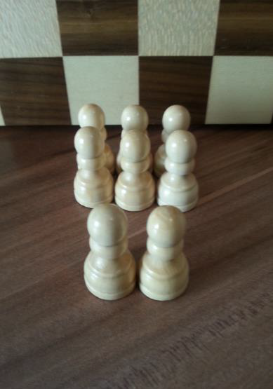
    

        The player receives four starting figures. At the beginning of each turn, four of the maximum eight Mercenaries are drawn. During the turn, any number of Mercenaries can be used to reinforce an attack, with one Mercenary counting as one attack point. After the attack, the Mercenaries are put back and are no longer available to the player. At the end of the turn, Mercenaries can be placed on defense cards to reinforce them. If the respective defense card is defeated, the corresponding Mercenaries are also defeated.
    

#### Spy

    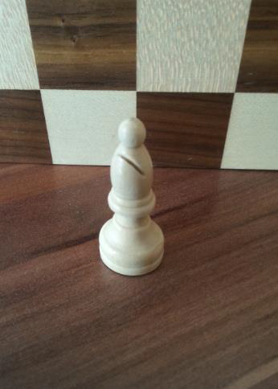
    

        With the Spy, the player can reveal a facedown defense card of an opponent during their turn. If the player discards one of their hand cards, they can reveal two more cards. If an opponent has no more defense cards to reveal, their King can also be uncovered.
    

#### General

    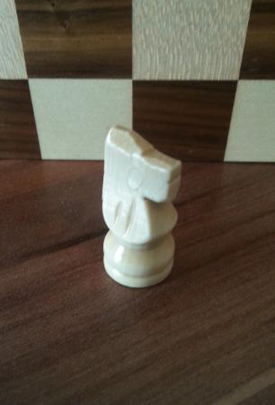
    

        The General allows the player to mobilize their defense cards more quickly. The player 
can take three actions, with one action corresponding to placing or removing a defense card.
    

#### Battery Tower

    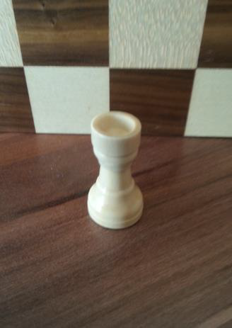
    

        The Battery Tower allows the player to decline an attack. The attacking player no longer 
has 
access to the corresponding attack cards during their turn. After a blocked attack, the Battery 
Tower can no longer be used and must be reactivated during the owner's next turn. The attacking 
player can keep the attack cards face down during the attack as long as the Battery Tower is 
still active.
    

#### Merchant

    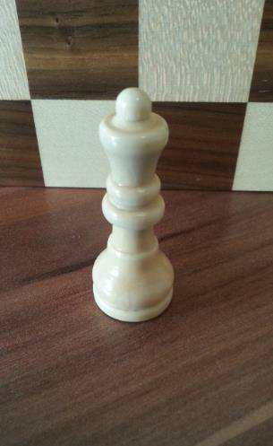
    

        The Merchant allows the player to discard any hand card and draw a new card from the stack during their turn. The discarded card is then visible to the other players, while the newly acquired card can remain face down.
    

#### Priest

    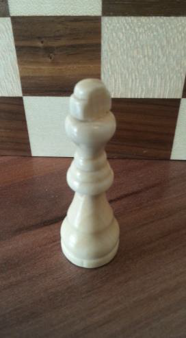
    

        After the player has initiated an attack, thus setting the attack symbol for their turn, they can use the ability of the Priest. The player can now draw a card from the hand cards of any opponent. If the symbol matches the attack symbol, the player may keep the card; otherwise, they must return it. If the first attempt fails, the process can be repeated once. The second card can also be drawn from a different opponent.
    

### Dark Force

#### Reservists

    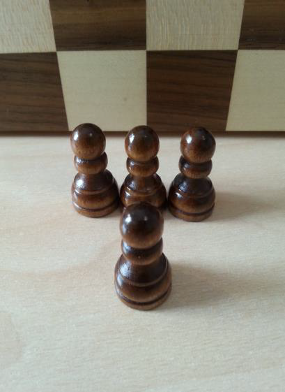
    

        The player receives two Reservists upon acquiring the Hero. At the beginning of each turn, 
two more of the four Reservists can be enlisted. Reservists can be used to enhance attacks, with each Reservist counting as one attack point and no longer being available to the player after the attack. Reservists can also be used for post-attack reinforcement. Thus, a narrowly lost attack can still turn into a successful attack
    

#### Saboteurs

    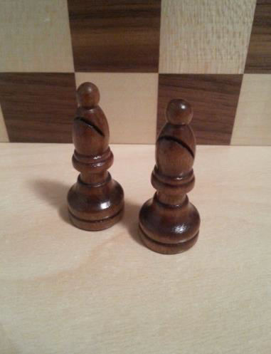
    

        During their turn, the player can place Saboteurs on the opponent's defense cards, whether they are face up or face down. The cards are thus blocked for the respective opponent and cannot be drawn by them during their turn. If the card is defeated, the besieging Saboteur returns to the owning player.
    

#### Lieutenant

    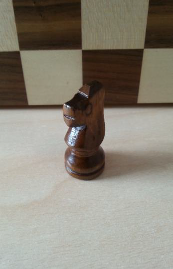
    

        The Field Marshal allows the player to use defense cards directly for the attack. The first card played in this manner determines the attack symbol for the subsequent attacks from the defense cards. The defense cards can be combined with each other in this case. Defense cards laid during the turn can also be used for the attack.
    

#### Fortified Tower

    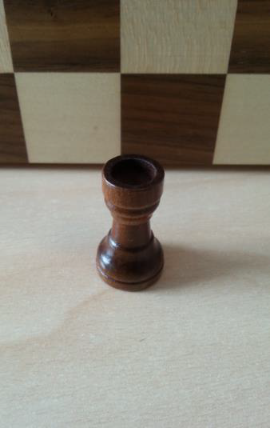
    

        With the Watchtower, the player can, during their turn, place a card face down on one of their defense cards. The symbols must match. If the card is attacked, both defense cards are revealed, and their values are counted together as the defense value. If the card is spied upon, only the top card is revealed. When picking up the defense cards, both cards must be added to the hand cards, and this is counted as one action.
    

#### Mage

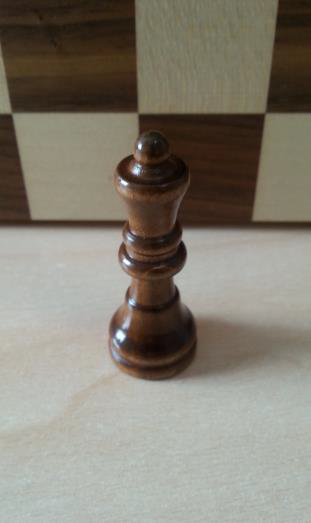

    
    

        With the Magician, the player can, during their turn, remove an opponent's defense card and replace it with a new one from the stack. If the card was previously face down, the new card is placed face up, and vice versa.
    

#### Warlord

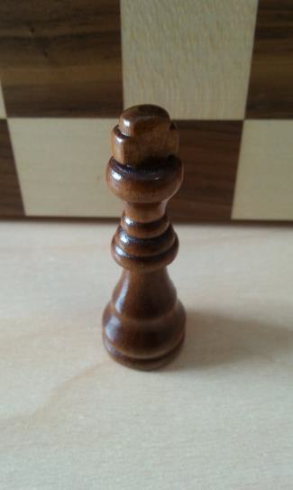

    
    

        The Warlord allows the player to initiate a direct attack with the King. The stack 
cannot be attacked in this case, and the King cannot be combined with other attack cards. The King's symbol must match the current attack symbol. If the defense and attack values are equal, nothing happens. If the King's value is lower than the defense value, the player loses. The King can be reinforced with Mercenaries and Reservists.
    

## Variants

### Speed-Baisch

### Basic-Baisch

## FAQ

