# Baisch - Rules Book

This page is the short and practical rules reference for live games.

## Goal

Be the last player still in the game.

You are eliminated when your king is defeated in a king assault.

## Setup Overview

Each player starts with:
- 1 king card (face-down)
- up to 3 defense cards in slots 1-3 (face-down)
- hand cards

Shared board:
- main deck
- cemetery (discard pile)
- 2 center picking decks for plunder

## Turn Order

Default rule:
- At round start, players roll dice to determine turn order.

Optional rule:
- Skip dice and use fixed clockwise order from a chosen starting player.

## Turn Flow

On your turn, you can:
- take one of your defense cards back to hand
- put a hand card as a new face-down defense card
- plunder one picking deck
- attack enemy defense cards
- attack an enemy king if legal
- use hero abilities

End your turn with Finish Turn.

## Card Strength Basics

- Number cards: face value
- J, Q, K, A: 11, 12, 13, 14
- Joker in hand attacks as a wild high-impact card
- Joker as a defense card counts as 1

## Core Actions

### 1) Plunder

Attack one of the two center picking decks.

- Success: you take all cards from that picking deck.
- Fail: the deck grows and becomes a larger future target.

### 2) Attack Enemy Defense

Use hand cards to beat an enemy defense value.

- Success: captured card(s) go to your hand as prey cards.
- Fail: target remains and is usually revealed.

### 3) King Assault (Attack Enemy King)

If the enemy has no defense left, you can attack their king.

- Success: defender is eliminated.
- If you used your own king and fail, you can be eliminated.

### 4) Manage Defense

Build and reposition your defense to stay protected while preparing attacks.

## Prey Cards

Captured cards this turn are prey cards.

- Prey cards are locked for the rest of your current turn.
- They become usable normally on your next turn.

## Heroes

You gain heroes by sacrificing a joker.

Draw mapping:

| Drawn Card | Hero / Result |
|---|---|
| 2 | Mercenaries |
| 3 | Marshal |
| 4 | Spy |
| 5 | Battery Tower |
| 6 | Merchant |
| 7 | Priest |
| 8 | Reservists |
| 9 | Banneret |
| 10 | Saboteurs |
| J | Fortified Tower |
| Q | Magician |
| K | Warlord |
| Red Ace | Choose a white hero (2-7) |
| Black Ace | Choose a black hero (8-K) |
| Joker | Free choice of any hero |

### White Heroes

#### Mercenaries

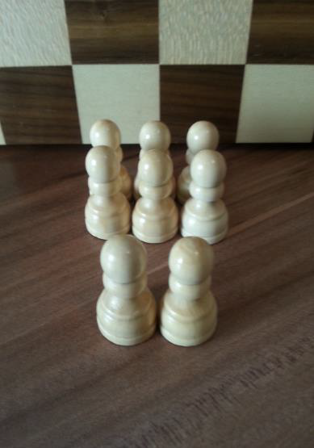

How to use:
- Select Mercenaries during your turn before resolving an attack.
- Spend one ready mercenary to add +1 attack value.
- Repeat as needed while ready units are available.

Important rules:
- Mercenaries are temporary units and recover over turns.
- They can be used to swing close attack or plunder calculations.
- If a mercenary on a defended position is destroyed, it is lost and must recover.

Best use:
- Save units for key combats where +1 to +3 changes the outcome.

#### Marshal

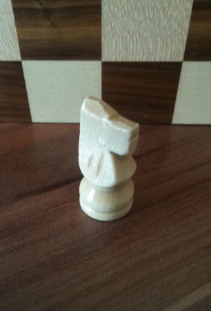

How to use:
- Marshal modifies your defense management economy each turn.
- You can perform more mobilization actions (take/put) than normal.

Important rules:
- Mobilization means taking a defense card back to hand or placing one from hand to defense.
- Use this to rebuild defense without sacrificing tempo.

Best use:
- Reorganize weak slots and still keep enough cards for attacks in the same turn.

#### Spy

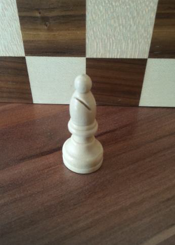

How to use:
- Activate Spy during your turn to reveal a face-down enemy defense card.
- If available in your ruleset, discard one hand card to gain additional reveals.

Important rules:
- Revealed cards remove uncertainty and let you plan exact attack sums.
- Spy is strongest before committing high-value attack cards.

Best use:
- Reveal first, then choose the lowest-risk attack target.

#### Battery Tower

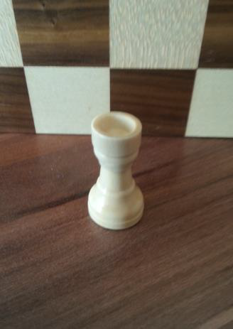

How to use:
- Battery Tower triggers when an opponent attacks your defense or king.
- Choose to deny the attack while the tower is charged.

Important rules:
- Denied attack cards are locked for the attacker for the rest of that turn.
- Tower typically has limited charges and must recover.

Best use:
- Deny expensive attacks to create major tempo advantage.

#### Merchant

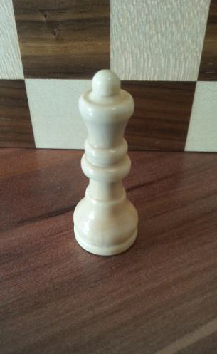

How to use:
- During your turn, select Merchant and one card you want to replace.
- Discard that card and draw a replacement from the main deck.

Important rules:
- Merchant is usually limited to one trade per turn.
- Use it to remove low-impact or off-plan cards.

Best use:
- Fix weak hands before a planned attack turn.

#### Priest

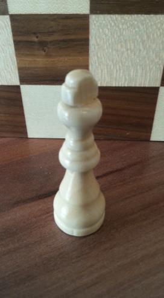

How to use:
- First establish your current attack suit (by starting an attack).
- Activate Priest and choose an opponent hand target.
- If revealed card matches your active suit, you convert/steal it; otherwise it is returned.

Important rules:
- Priest has limited attempts per turn.
- Timing matters: Priest is only strong after suit has been fixed for your turn.

Best use:
- Use right after setting a suit where opponents are likely to hold many cards.

### Dark Heroes

#### Reservists

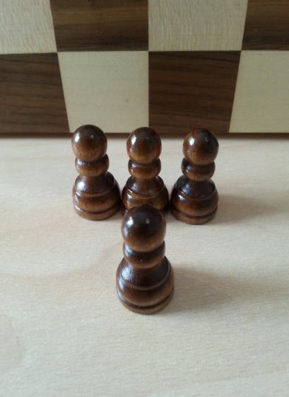

How to use:
- Reservists passively reinforce king defense.
- During attack/plunder resolution, spend reservists for +1 attack each when needed.

Important rules:
- Units are finite and recover over turns.
- Spending too many reduces your king safety.

Best use:
- Keep a defensive baseline, spend only the minimum needed to secure key wins.

#### Banneret

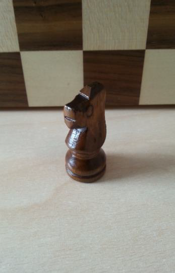

How to use:
- Banneret allows broader attack composition (paired suits / mixed pattern, depending on your table rules).
- It also enables attack lines that include your own defense cards.

Important rules:
- Confirm your active suit pattern before committing cards.
- You trade board security for offensive burst when using own defense cards.

Best use:
- Convert a stable defense into a sudden high-value finishing attack.

#### Saboteurs

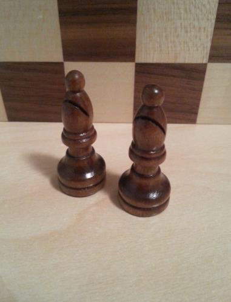

How to use:
- During your turn, place a saboteur on an enemy defense slot.
- That slot becomes blocked for defense management until cleared.

Important rules:
- Saboteurs are limited units with recovery time after destruction.
- Opponents can remove them by resolving the slot through combat/sacrifice rules.

Best use:
- Lock high-value slots to prevent enemy repositioning before your next attack.

#### Fortified Tower

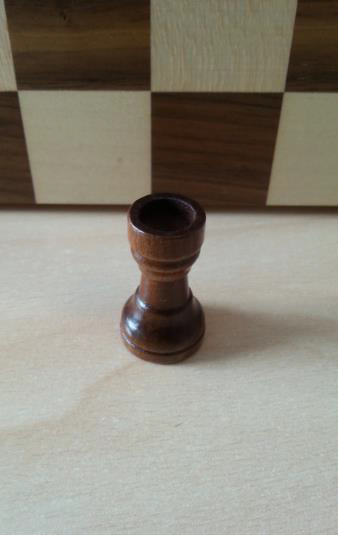

How to use:
- Select Fortified Tower and choose one of your existing defense slots.
- Place an extra face-down top defense card onto that slot.

Important rules:
- Attacker must beat the combined defense value to capture it.
- Usually limited number of tower uses per turn.

Best use:
- Protect key slot(s) right before passing turn.

#### Magician

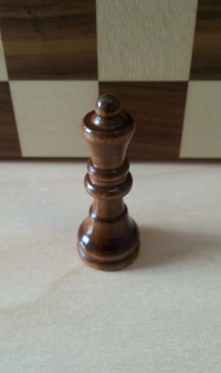

How to use:
- During your turn, target an existing defense slot (yours or enemy, depending on table rules).
- Replace the slot card(s) with fresh draw(s) from the main deck.

Important rules:
- Replaced cards go to cemetery.
- Usually one spell use per turn.

Best use:
- Reset strong revealed enemy defenses into unknown or weaker values.

#### Warlord

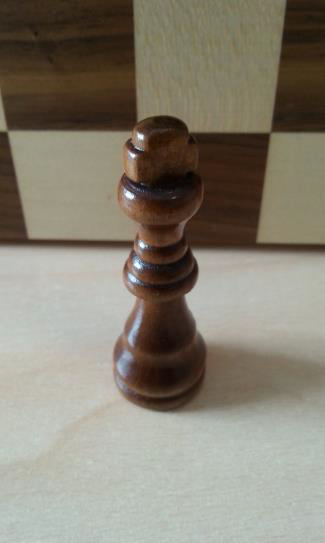

How to use:
- Warlord unlocks aggressive king-based attack options.
- You can launch special king attacks and use king-swap tactics.

Important rules:
- King-based attacks are high risk: failed commits can expose your own king.
- Respect one-use/charge limits per turn where applicable.

Best use:
- Use after reducing enemy defense to convert initiative into elimination pressure.

## Optional Rules

- Turn order variant: fixed clockwise order (no dice roll each round).
- Recommended for faster games and simpler onboarding.

## Win Condition

The last non-eliminated player wins.

## New Player Tips

1. Keep at least one strong hidden defense while building offense.
2. Plunder early if your hand is weak.
3. Avoid king assault unless odds are clearly good.
4. Use jokers when a hero can immediately impact your turn.
5. Track enemy hero resources before committing attacks.

